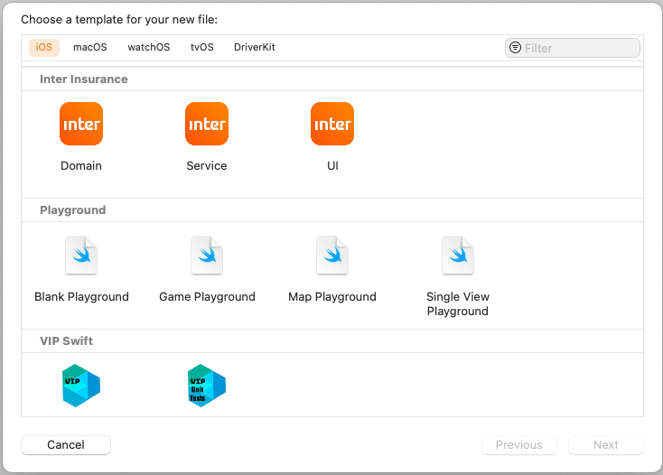

<h1 align="center">
    
</h1>

# Inter Insurance Template iOS

Template para a Tribo de Seguros do Banco Inter, contemplando arquivos para as camadas de Domain, Service e UI, já relacionando com protocolos da nossa Tribo.

Para instalar e usar, baixar pasta "Inter Insurance" e colar em "~/Library/Developer/Xcode/Templates/File Templates", após isso somente reiniciar o Xcode e usar normalmente como qualquer Template.
